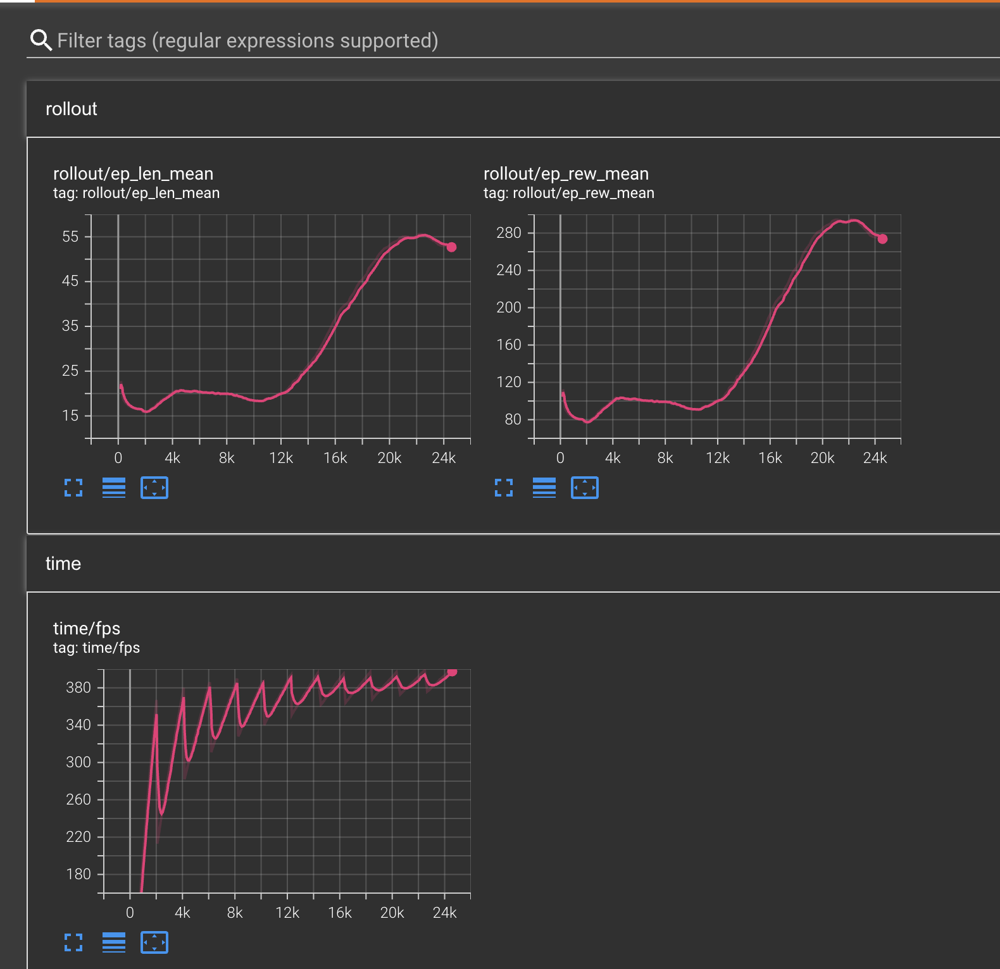

# Burst: Robotics RL Pipeline


## Overview
Burst is a modular, containerized reinforcement learning pipeline for robotics. It enables fast, reproducible training of RL agents (PPO, SAC, etc.), experiment tracking, and easy deployment. The system is designed for both local and cloud (GPU) execution, and includes a backend service for future API/UI integration.




## Value Proposition
- One-command setup for parallel RL training and experiment tracking
- Supports multiple RL algorithms (PPO, SAC, extensible)
- GPU-ready, cloud-friendly (EC2, GCP, etc.)
- Modular: backend and multiple trainers run as separate services
- Results and logs are easy to access and download

---

## Quickstart (Local, with Docker Compose)

### 1. Build and start all services
```bash
docker compose build
docker compose up
```
- `trainer-ppo`: runs PPO RL training, writes logs and outputs
- `trainer-sac`: runs SAC RL training, writes logs and outputs
- `api`: backend service (runs on port 8000)
- `tensorboard`: available at http://localhost:6006/

### 2. Stop all services
```bash
docker compose down
```

### 3. View logs
```bash
docker compose logs -f trainer-ppo
docker compose logs -f trainer-sac
```

---

## Running on a Remote GPU Server (e.g. EC2)

1. SSH into your instance:
```bash
ssh -i <key.pem> ubuntu@<EC2-IP>
```
2. Install Docker & Docker Compose:
```bash
curl -fsSL https://get.docker.com -o get-docker.sh && sh get-docker.sh
sudo usermod -aG docker $USER
exit # then reconnect
```
3. Install NVIDIA Container Toolkit (for GPU):
```bash
# See https://docs.nvidia.com/datacenter/cloud-native/container-toolkit/install-guide.html
```
4. Copy project from your local machine:
```bash
scp -i <key.pem> -r ~/burst-cursor-for-robotics ubuntu@<EC2-IP>:~/
```
5. Build and start:
```bash
cd burst-cursor-for-robotics
docker compose --profile gpu build
docker compose --profile gpu up
```
- Access TensorBoard at http://<EC2-IP>:6006/
- Backend API at http://<EC2-IP>:8000/

---

## Download Results

From your local machine:
```bash
scp -i <key.pem> -r ubuntu@<EC2-IP>:~/burst-cursor-for-robotics/output ./
scp -i <key.pem> -r ubuntu@<EC2-IP>:~/burst-cursor-for-robotics/tensorboard_logs ./
```

---

## Expected Outputs
- Trained models: `output/ppo/policy.onnx`, `output/sac/policy.onnx`
- Videos: `output/ppo/videos/`, `output/sac/videos/`
- TensorBoard logs: `tensorboard_logs/`

---

## Troubleshooting
- If you get GPU errors, check NVIDIA drivers and container toolkit
- If ports are busy, change them in `docker-compose.yml`
- To iterate: edit code, rebuild (`docker compose build`), and restart (`docker compose up`)

---

## Project Structure
- `train.py`, `train_sac.py` : RL training entrypoints (PPO/SAC)
- `api/` : backend service (FastAPI, placeholder)
- `output/ppo/`, `output/sac/` : trained models, videos
- `tensorboard_logs/` : logs for TensorBoard
- `docker-compose.yml` : service orchestration

---

For automation, consider writing a Makefile or shell script for common workflows.
